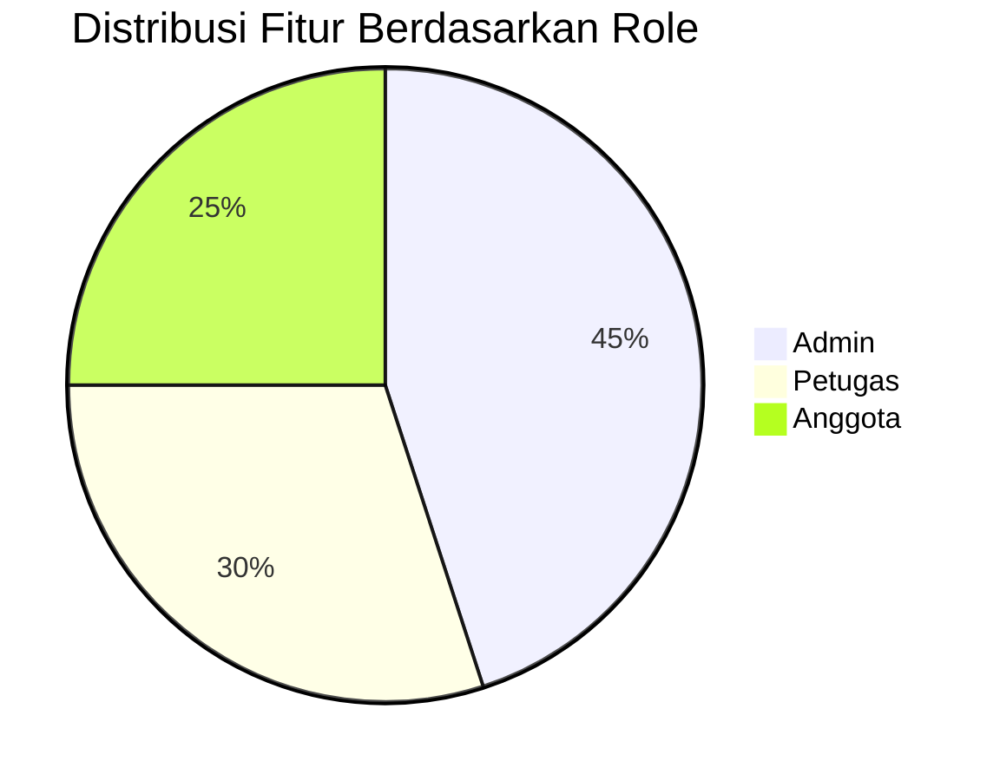
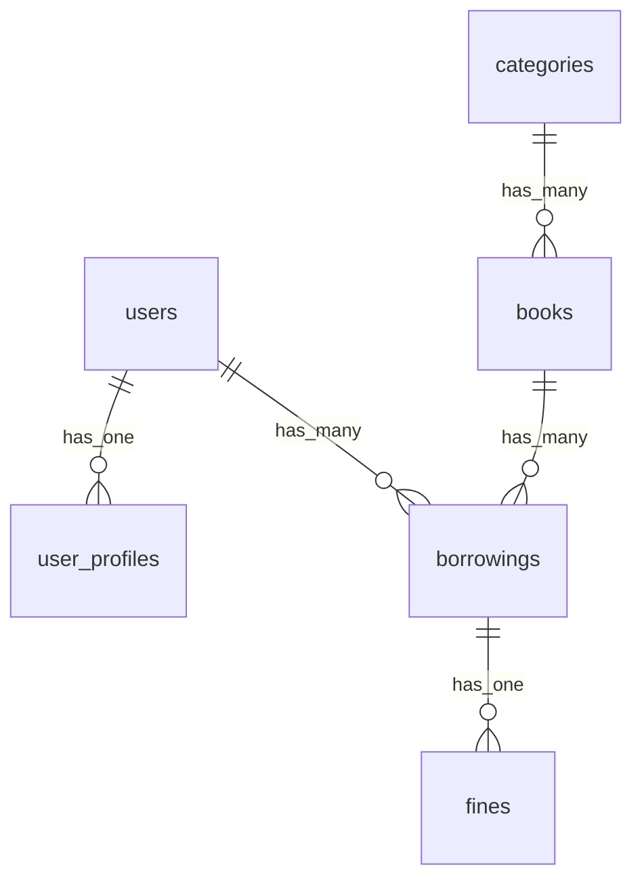
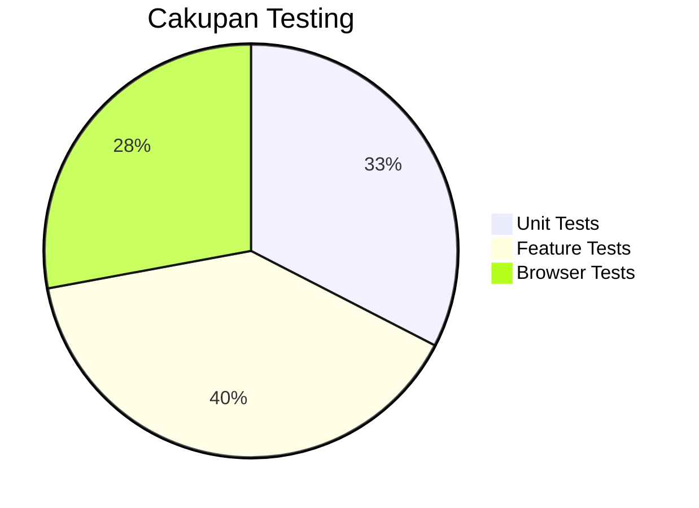

# 📖 Sistem Manajemen Perpustakaan Digital v1.0 - Dokumentasi Lengkap


## 🌟 Preview Aplikasi


*Dashboard Admin - Tampilan statistik dan ringkasan aktivitas*


*Modul Manajemen Buku - Tampilan daftar buku dengan fitur pencarian dan filter*

## 📚 Daftar Isi

1. [Deskripsi Proyek](#-deskripsi-proyek)
2. [Fitur Unggulan](#-fitur-unggulan)
3. [Arsitektur Sistem](#-arsitektur-sistem)
4. [Struktur Database](#-struktur-database)
5. [Panduan Instalasi](#-panduan-instalasi-lengkap)
6. [Konfigurasi Lanjutan](#-konfigurasi-lanjutan)
7. [Panduan Penggunaan](#-panduan-penggunaan)
8. [Testing](#-testing-dan-qa)
9. [Roadmap Pengembangan](#-roadmap-pengembangan)
10. [Lisensi](#-lisensi)
11. [Kontribusi](#-kontribusi)

---

## � Deskripsi Proyek

**Sistem Manajemen Perpustakaan Digital** adalah solusi komprehensif untuk mengelola operasional perpustakaan modern berbasis web. Dibangun dengan Laravel 12, sistem ini menawarkan:

- **Manajemen Koleksi Digital**: Katalogisasi buku fisik dan digital
- **Otomasi Proses**: Peminjaman, pengembalian, dan perhitungan denda otomatis
- **Multi-role Access**: Sistem hak akses terperinci untuk admin, staf, dan anggota
- **Analitik Data**: Laporan statistik dan tren peminjaman

### 🎯 Tujuan Pengembangan
1. Menyediakan platform open-source untuk perpustakaan sekolah/universitas
2. Demonstrasi best practices pengembangan Laravel modern
3. Template untuk pengembangan sistem manajemen berbasis role

### 🧩 Komponen Utama
- Backend: Laravel 12 + MySQL
- Frontend: Tailwind CSS + Alpine.js
- Tooling: Vite, Laravel Sail
- Layanan Pendukung: Export PDF, File Upload

---

## ✨ Fitur Unggulan

### 🛠️ Modul Inti
| Modul | Deskripsi | Teknologi Terkait |
|-------|-----------|-------------------|
| **Manajemen Buku** | CRUD lengkap dengan upload cover, manajemen stok | Intervention Image, Laravel Media Library |
| **Manajemen Anggota** | Registrasi, verifikasi, dan profil anggota | Laravel Breeze, Spatie Roles |
| **Transaksi** | Peminjaman, pengembalian, perpanjangan | Laravel Cashier (untuk denda) |
| **Laporan** | Statistik peminjaman, ekspor PDF | Laravel Excel, DomPDF |

### 🔐 Sistem Keamanan
- Otorisasi berbasis role dengan middleware
- Proteksi terhadap SQL Injection dan XSS
- Validasi form server-side
- Proteksi CSRF token

### 📱 Fitur Khusus


---

## 🏗️ Arsitektur Sistem

### 📦 Struktur Folder Penting
```
app/
├── Http/
│   ├── Controllers/
│   │   ├── Admin/
│   │   ├── Auth/
│   │   └── Member/
│   └── Requests/
database/
├── factories/
├── migrations/
├── seeders/
public/
├── storage/
resources/
├── js/
├── lang/
└── views/
```

### 🔧 Teknologi Pendukung
- **Laravel Breeze**: Sistem autentikasi
- **Laravel DomPDF**: Generasi laporan PDF
- **Laravel Telescope**: Debugging lokal
- **Laravel Sanctum**: API Authentication

---

## 🗃️ Struktur Database

### 📊 Diagram ERD


### 📌 Tabel Utama
1. **users**: Data login semua user
2. **user_profiles**: Profil lengkap anggota
3. **books**: Katalog buku
4. **borrowings**: Transaksi peminjaman
5. **fines**: Data denda

---

## 🚀 Panduan Instalasi Lengkap

### 🔍 Prasyarat Sistem
| Komponen | Versi Minimal | Rekomendasi |
|----------|---------------|-------------|
| PHP | 8.2 | 8.3 |
| MySQL | 5.7 | 8.0 |
| Node.js | 16.x | 20.x |
| Composer | 2.5 | Latest |

### 📥 Langkah Instalasi
1. Clone repositori:
   ```bash
   git clone https://github.com/username/perpus-digital.git
   cd perpus-digital
   ```

2. Install dependencies:
   ```bash
   composer install
   npm install
   ```

3. Setup environment:
   ```bash
   cp .env.example .env
   php artisan key:generate
   ```

4. Konfigurasi database di `.env`:
   ```env
   DB_DATABASE=perpus_digital
   DB_USERNAME=root
   DB_PASSWORD=
   ```

5. Jalankan migrasi:
   ```bash
   php artisan migrate --seed
   ```

6. Build assets:
   ```bash
   npm run build
   ```

7. Jalankan server:
   ```bash
   php artisan serve
   ```

---

## ⚙️ Konfigurasi Lanjutan

### 🔧 Pengaturan Penting di .env
```env
APP_TIMEZONE=Asia/Jakarta
FINES_RATE=5000 # Denda per hari (Rp)
MAX_BORROW_DAYS=14 # Maksimal hari peminjaman
```

### 🛠️ Perintah Artisan Berguna
```bash
# Reset database dengan data dummy
php artisan migrate:fresh --seed

# Generate laporan testing
php artisan generate:report --type=borrowings

# Clear cache
php artisan optimize:clear
```

---

## 📝 Panduan Penggunaan

### 👨‍💻 Akun Default
| Role | Email | Password |
|------|-------|----------|
| Admin | admin@perpus.test | password |
| Petugas | staff@perpus.test | password |
| Anggota | member@perpus.test | password |

### 📚 Alur Peminjaman Buku
1. Login sebagai petugas
2. Cari buku di modul Katalog
3. Pilih "Proses Peminjaman"
4. Scan/input ID anggota
5. Konfirmasi transaksi

---

## � Testing dan QA

### ✅ Test Coverage


### 🧪 Menjalankan Test
```bash
php artisan test
php artisan dusk
```

---

## 🛣️ Roadmap Pengembangan

### 🚧 Rencana Versi Berikutnya
- [ ] Integrasi pembayaran denda online
- [ ] Sistem rating dan ulasan buku
- [ ] Pencarian buku dengan Elasticsearch
- [ ] Mobile app dengan React Native

---
---

## 🤝 Kontribusi

Kami menyambut kontribusi! Silakan:
1. Fork proyek ini
2. Buat branch fitur baru
3. Ajukan Pull Request

**Pedoman Kontribusi**:
- Ikuti PSR-12 coding standard
- Sertakan test untuk fitur baru
- Dokumentasikan perubahan besar

---

<div align="center">
  <p>✨ <strong>Sistem Manajemen Perpustakaan Digital</strong> ✨</p>
  <p>Dibangun dengan ❤️ menggunakan Laravel</p>
</div>
