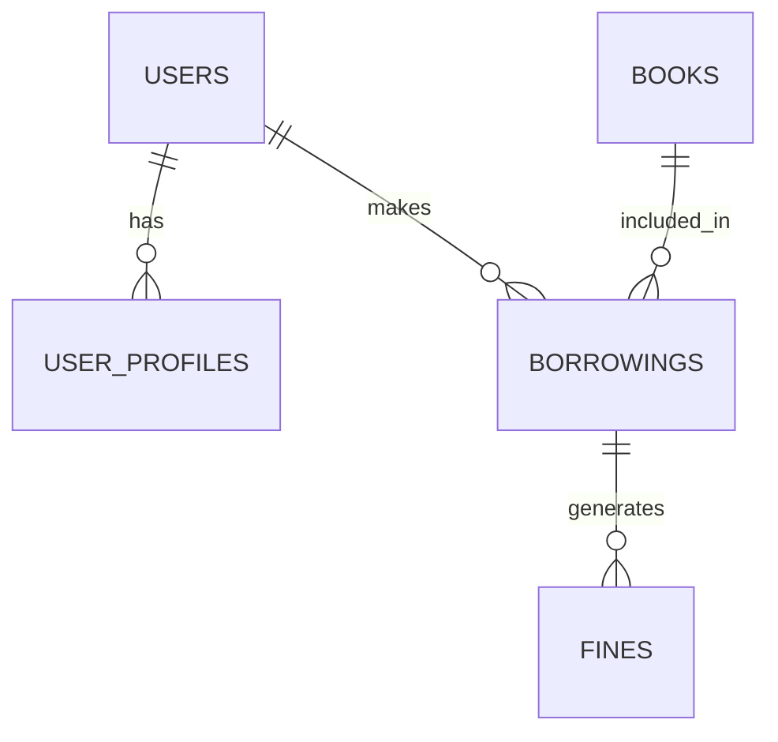

Berikut perbaikan penataan README.md yang lebih rapi dan profesional dalam Bahasa Indonesia:

---
# 📚 Sistem Manajemen Perpustakaan Digital v1.0


## 📖 Daftar Isi
1. [Deskripsi Proyek](#-deskripsi-proyek)
2. [Fitur Utama](#-fitur-utama)
3. [Teknologi Digunakan](#-teknologi-digunakan)
4. [Struktur Database](#-struktur-database)
5. [Panduan Instalasi](#-panduan-instalasi)
6. [Panduan Penggunaan](#-panduan-penggunaan)
7. [Testing](#-testing)
8. [Roadmap](#-roadmap)
9. [Lisensi](#-lisensi)
10. [Kontribusi](#-kontribusi)

## 🌟 Deskripsi Proyek
Sistem Manajemen Perpustakaan Digital adalah aplikasi web berbasis Laravel yang dirancang untuk:
- Mengelola koleksi buku digital
- Memproses transaksi peminjaman
- Mengelola keanggotaan perpustakaan
- Menghasilkan laporan statistik

> *"Aku tidak berilmu; yang berilmu hanyalah DIA. Jika tampak ilmu dariku, itu hanyalah pantulan dari Cahaya-Nya."*

## 🎥 Demo
[]

## ✨ Fitur Utama

### 🛠️ Fitur Administrasi
- **Manajemen Buku** (CRUD lengkap dengan upload cover)
- **Manajemen Kategori** dengan sistem relasi
- **Manajemen Anggota** dengan verifikasi data
- **Sistem Peminjaman** dengan tracking status
- **Perhitungan Denda** otomatis

### 📊 Fitur Laporan
- Statistik peminjaman
- Ekspor data ke PDF
- Riwayat transaksi

### 👤 Manajemen Pengguna
- Sistem role-based (Admin, Petugas, Anggota)
- Autentikasi aman dengan Laravel Breeze
- Profil pengguna yang dapat dikustomisasi

## 🛠️ Teknologi Digunakan
| Komponen | Teknologi |
|----------|-----------|
| Backend  | Laravel 12, PHP 8.2+ |
| Frontend | Blade, Tailwind CSS, Alpine.js |
| Database | MySQL |
| Lainnya  | Laravel Breeze, DomPDF |

## 🗃️ Struktur Database




## 🚀 Panduan Instalasi

### Prasyarat
- PHP 8.2+
- Composer
- Node.js 16+
- MySQL 5.7+

### Langkah-langkah
1. Clone repositori:
   ```bash
   git clone https://github.com/username/repo.git
   cd repo
   ```

2. Install dependencies:
   ```bash
   composer install
   npm install
   ```

Bash

cp .env.example .env
Generate kunci aplikasi:

Bash

php artisan key:generate
Konfigurasi database Anda di file .env:

Cuplikan kode

DB_CONNECTION=mysql
DB_HOST=127.0.0.1
DB_PORT=3306
DB_DATABASE=db_perpustakaan
DB_USERNAME=root
DB_PASSWORD=
Pastikan Anda sudah membuat database db_perpustakaan di server database Anda.

Jalankan migrasi dan seeder database:
Perintah ini akan membuat semua tabel dan mengisinya dengan data awal (termasuk akun admin, petugas, dan anggota).

Bash

php artisan migrate --seed
Buat symbolic link untuk storage:
Ini penting agar file yang di-upload (seperti sampul buku) bisa diakses.

Bash

php artisan storage:link
Install dependensi frontend (Node.js):

Bash

npm install
Jalankan server pengembangan:

Buka satu terminal dan jalankan Vite untuk kompilasi aset:
Bash

npm run dev
Buka terminal kedua dan jalankan server aplikasi Laravel:
Bash

php artisan serve
Selesai! Aplikasi Anda sekarang berjalan di http://127.0.0.1:8000.

🔑 Cara Penggunaan
Setelah instalasi berhasil, Anda dapat login menggunakan akun default yang telah dibuat oleh seeder:

Akun Admin:

Email: admin@perpus.com
Password: password
Akses: Memiliki akses ke semua fitur manajemen.
Akun Petugas:

Email: petugas@perpus.com
Password: password
Akses: Dapat login, namun belum memiliki menu khusus (dapat dikembangkan lebih lanjut).
Akun Anggota:

Email: anggota@perpus.com
Password: password
Akses: Dapat login dan melihat dashboard standar.