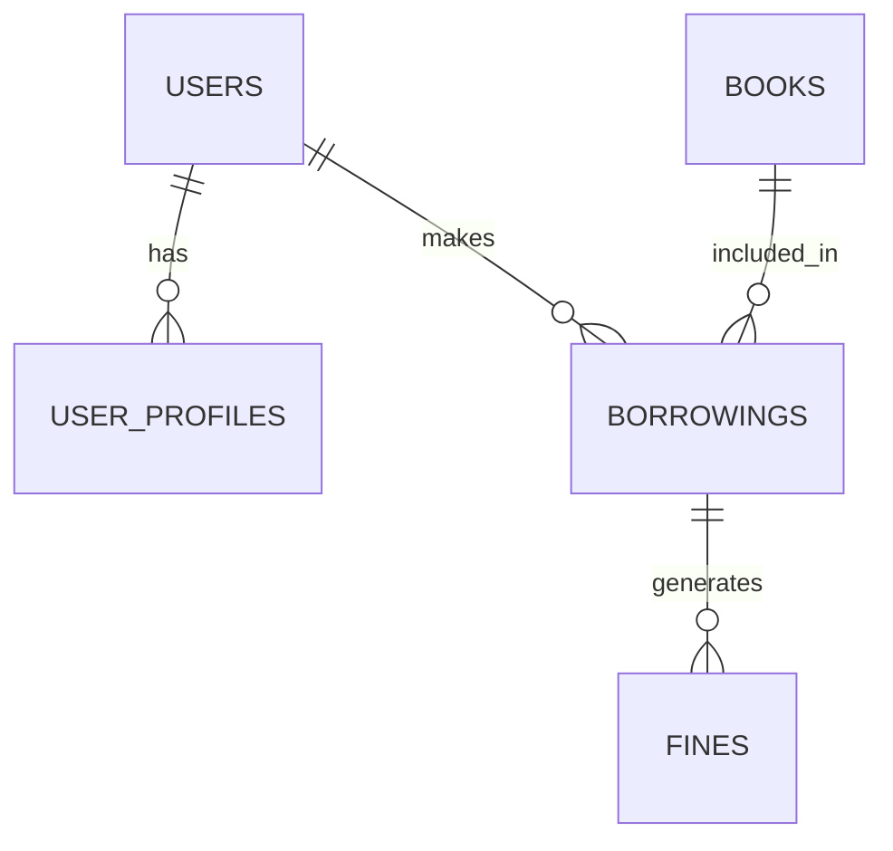

<p align="center"><a href="https://laravel.com" target="_blank"></a></p>

<p align="center">
<a href="https://github.com/laravel/framework/actions"></a>
<a href="https://packagist.org/packages/laravel/framework"></a>
<a href="https://packagist.org/packages/laravel/framework"></a>
</p>

# 📚 Sistem Manajemen Perpustakaan Digital v1.0
Sistem Manajemen Perpustakaan Digital adalah perangkat lunak yang dirancang untuk mengelola
semua fungsi perpustakaan secara digital, mulai dari mengelola koleksi hingga transaksi anggota.

## ✨ Kutipan
"Aku tidak berilmu; yang berilmu hanyalah DIA. Jika tampak ilmu dariku, itu hanyalah pantulan dari Cahaya-Nya."

## 📖 Daftar Isi
1. [Deskripsi Proyek](#-deskripsi-proyek)
2. [Fitur Utama](#-fitur-utama)
3. [Teknologi Digunakan](#-teknologi-digunakan)
4. [Struktur Database](#-struktur-database)
5. [Panduan Instalasi](#-panduan-instalasi)
6. [Panduan Penggunaan](#-panduan-penggunaan)
7. [Testing](#-testing)
8. [Roadmap](#-roadmap)
9. [Kontribusi](#-kontribusi)

## 🎥 Demo


## 🌟 Deskripsi Proyek
Sistem Manajemen Perpustakaan Digital adalah aplikasi web berbasis Laravel yang dirancang untuk:
- Mengelola koleksi buku digital
- Memproses transaksi peminjaman
- Mengelola keanggotaan perpustakaan
- Menghasilkan laporan statistik


## ✨ Fitur Utama

### 🛠️ Fitur Administrasi
- **Manajemen Buku** (CRUD lengkap dengan upload cover)
- **Manajemen Kategori** dengan sistem relasi
- **Manajemen Anggota** dengan verifikasi data
- **Sistem Peminjaman** dengan tracking status
- **Perhitungan Denda** otomatis

### 👤 Fitur Petugas
- Bisa melihat seluruh daftar riwayat peminjaman dan pengembalian.
- Bisa mencatat peminjaman baru untuk anggota (+ Catat Peminjaman).
- Bisa memproses pengembalian buku (Kembalikan), yang juga secara otomatis akan membuat denda jika terlambat.
- Mengelola Modul Denda:
    - Bisa melihat daftar semua denda yang belum dibayar.
    - Bisa menandai denda sebagai "Lunas" setelah anggota membayarnya.

### 👤 Fitur Member (User)
- Profil lengkap + statistik peminjaman & denda
- Riwayat Peminjaman Anggota
- Daftar Denda Pribadi

### 📊 Fitur Laporan
- Statistik peminjaman
- Ekspor data ke PDF
- Riwayat transaksi

### 👤 Manajemen Pengguna
- Sistem role-based (Admin, Petugas, Anggota)
- Autentikasi aman dengan Laravel Breeze
- Profil pengguna yang dapat dikustomisasi

## 🛠️ Teknologi Digunakan
| Komponen | Teknologi |
|----------|-----------|
| Backend  | Laravel 12, PHP 8.2+ |
| Frontend | Blade, Tailwind CSS, Alpine.js |
| Database | MySQL |
| Lainnya  | Laravel Breeze, DomPDF |

## 🗃️ Struktur Database




## 🚀 Panduan Instalasi

Bagian ini memuat tiga skenario instalasi: untuk pengembangan lokal, deployment ke server VPS (atau shared hosting dengan SSH), dan deployment ke shared hosting tanpa SSH (via cPanel).

---

### A. Instalasi di Komputer Lokal (Untuk Pengembangan)

Langkah-langkah ini ditujukan untuk menyiapkan lingkungan pengembangan di mesin Anda sendiri (misalnya, laptop atau PC).

#### Prasyarat
- **PHP 8.2+**, **Composer**, **Node.js 16+**, **Server Database** (MySQL/MariaDB), **Git**.

#### Langkah-langkah Instalasi
1.  **Clone Repositori**: `git clone https://github.com/Alghifari888/website-manajemen-perpustakaan.git` dan `cd website-manajemen-perpustakaan`
2.  **Install Dependensi**: Jalankan `composer install` dan `npm install`.
3.  **Konfigurasi .env**: Salin `.env.example` ke `.env` (`cp .env.example .env`).
4.  **Generate Kunci**: Jalankan `php artisan key:generate`.
5.  **Setup Database**: Buat database `db_perpustakaan` dan sesuaikan kredensial di file `.env`.
6.  **Migrasi & Seeder**: Jalankan `php artisan migrate --seed`.
7.  **Symbolic Link**: Jalankan `php artisan storage:link`.
8.  **Jalankan Server**: Buka dua terminal. Di satu terminal, jalankan `npm run dev`. Di terminal lain, jalankan `php artisan serve`.
9.  **Akses Aplikasi**: Buka `http://127.0.0.1:8000` di browser Anda.

---

### B. Deployment ke Server VPS / Shared Hosting (Dengan Akses SSH)

Panduan ini untuk server yang memberikan Anda akses terminal/SSH.

#### Prasyarat Server
- Akses SSH, Git, PHP 8.2+, Composer, Node.js, Nginx/Apache, MySQL/MariaDB.

#### Langkah-langkah Deployment
1.  **Clone Repositori**: Hubungkan via SSH, `cd` ke direktori web Anda, lalu `git clone ...`.
2.  **Konfigurasi .env Produksi**:
    - `cp .env.example .env`
    - Edit file `.env`: set `APP_ENV=production`, `APP_DEBUG=false`, dan isi detail database produksi.
    - Jalankan `php artisan key:generate`.
3.  **Install Dependensi Produksi**:
    - `composer install --optimize-autoloader --no-dev`
    - `npm install`
    - `npm run build`
4.  **Migrasi & Optimasi**:
    - `php artisan migrate --force`
    - `php artisan config:cache`
    - `php artisan route:cache`
    - `php artisan view:cache`
5.  **Konfigurasi Web Server**: Arahkan *Document Root* ke folder `/public` proyek Anda.
6.  **Atur Hak Akses**: `sudo chown -R www-data:www-data storage bootstrap/cache` dan `sudo chmod -R 775 storage bootstrap/cache`.
7.  **Symbolic Link**: `php artisan storage:link`.

---

### C. Deployment ke Shared Hosting (via cPanel / Tanpa SSH)

Metode ini bersifat manual dan cocok untuk hosting yang tidak menyediakan akses terminal.

#### 1. Persiapan di Komputer Lokal
Sebelum mengunggah, siapkan proyek Anda di lokal terlebih dahulu.
1.  **Install Dependensi**: Pastikan Anda sudah menjalankan `composer install --optimize-autoloader --no-dev` dan `npm run build` di lokal. Ini penting karena Anda tidak bisa menjalankannya di server.
2.  **Hapus Folder `node_modules`**: Folder ini sangat besar dan tidak diperlukan di server. Hapus saja.
3.  **Buat File ZIP**: Kompres semua file dan folder proyek Anda (termasuk folder `vendor`) ke dalam satu file `.zip`.

#### 2. Unggah dan Ekstrak di cPanel
1.  **Login ke cPanel**: Buka `File Manager`.
2.  **Navigasi**: Masuk ke direktori `public_html`.
3.  **Unggah**: Gunakan tombol `Upload` untuk mengunggah file `.zip` yang sudah Anda buat.
4.  **Ekstrak**: Setelah selesai, klik kanan pada file `.zip` dan pilih `Extract`.

#### 3. Atur Struktur Folder
Struktur default Laravel tidak cocok untuk `public_html`. Lakukan langkah berikut:
1.  **Pindahkan Isi Folder `public`**: Masuk ke folder proyek hasil ekstrak, lalu masuk ke folder `public`. Pilih semua file di dalamnya (`index.php`, `.htaccess`, `assets`, dll.) dan pindahkan (`Move`) ke direktori `public_html`.
2.  **Edit `index.php`**:
    - Di dalam `public_html`, cari dan edit file `index.php`.
    - Ubah dua baris path berikut untuk menunjuk ke lokasi folder proyek Anda yang sebenarnya. Ganti `nama-folder-proyek` dengan nama folder tempat Anda mengekstrak file.
      ```php
      // Sebelum diubah
      require __DIR__.'/../vendor/autoload.php';
      $app = require_once __DIR__.'/../bootstrap/app.php';

      // Setelah diubah
      require __DIR__.'/nama-folder-proyek/vendor/autoload.php';
      $app = require_once __DIR__.'/nama-folder-proyek/bootstrap/app.php';
      ```

#### 4. Setup Database
1.  **Buat Database**: Di cPanel, cari `MySQL Database Wizard`. Ikuti langkah-langkah untuk membuat database baru, user database, dan password. **Catat ketiga informasi ini**. Berikan semua hak akses (`All Privileges`) kepada user tersebut.
2.  **Ekspor Database Lokal**: Di komputer lokal Anda, buka `phpMyAdmin`, pilih database `db_perpustakaan`, lalu ekspor (`Export`) menjadi file `.sql`.
3.  **Impor Database**: Kembali ke cPanel, buka `phpMyAdmin`, pilih database yang baru Anda buat, lalu impor (`Import`) file `.sql` tadi.

#### 5. Konfigurasi Final
1.  **Edit File `.env`**:
    - Di `File Manager`, navigasikan ke dalam `nama-folder-proyek`.
    - Edit file `.env`. Jika tidak terlihat, pastikan Anda menampilkan file tersembunyi (`Show Hidden Files`).
    - Atur `APP_ENV=production` dan `APP_DEBUG=false`.
    - Masukkan detail database (nama database, user, password) yang Anda catat dari `MySQL Database Wizard`.
    - Atur `APP_URL` menjadi nama domain Anda (misal: `APP_URL=https://www.domainanda.com`).
2.  **Symbolic Link**: cPanel biasanya tidak memiliki fitur untuk membuat symbolic link secara langsung. Anda mungkin perlu meminta bantuan teknis dari penyedia hosting atau jika mereka menyediakan fitur `Terminal`, Anda bisa jalankan `php artisan storage:link` dari sana. Jika tidak, upload manual ke `public_html/storage` mungkin diperlukan, namun ini kurang ideal.

## 🔑 Panduan Penggunaan
Setelah instalasi berhasil, Anda dapat login menggunakan akun default yang telah dibuat oleh seeder:

-   **Akun Admin:**
    -   **Email:** `admin@perpus.com`
    -   **Password:** `password`
-   **Akun Petugas:**
    -   **Email:** `petugas@perpus.com`
    -   **Password:** `password`
-   **Akun Anggota:**
    -   **Email:** `anggota@perpus.com`
    -   **Password:** `password`

## 🧪 Testing
Untuk menjalankan test suite, gunakan perintah berikut:
```bash
php artisan test
```

## 🗺️ Roadmap
- [ ] Implementasi fitur pencarian buku lanjutan (filter, sort).
- [ ] Integrasi notifikasi email untuk pengingat pengembalian.
- [ ] Pengembangan API untuk aplikasi mobile.
- [ ] Fitur booking buku online.

## 🤝 Berkontribusi
Kontribusi Anda sangat kami harapkan! Silakan ikuti langkah-langkah berikut:

1.  **Fork** project ini.
2.  Buat **branch fitur** baru (`git checkout -b fitur-keren-baru`).
3.  **Commit** perubahan Anda (`git commit -m 'Menambahkan fitur keren baru'`).
4.  **Push** ke branch (`git push origin fitur-keren-baru`).
5.  Buat **Pull Request** baru.

---

⭐ Jika project ini membantu, mohon beri **star** di GitHub!  
🔔 Pantau update terbaru untuk fitur-fitur baru!

## 📄 License (English)

This project is licensed under the MIT License.

Permission is hereby granted, free of charge, to any person obtaining a copy
of this software and associated documentation files (the "Software"), to deal
in the Software without restriction, including without limitation the rights
to use, copy, modify, merge, publish, distribute, sublicense, and/or sell
copies of the Software, subject to the following conditions:

The above copyright notice and this permission notice shall be included in all
copies or substantial portions of the Software.

THE SOFTWARE IS PROVIDED "AS IS", WITHOUT WARRANTY OF ANY KIND, EXPRESS OR
IMPLIED, INCLUDING BUT NOT LIMITED TO THE WARRANTIES OF MERCHANTABILITY,
FITNESS FOR A PARTICULAR PURPOSE AND NONINFRINGEMENT.

---

## 📄 Lisensi (Indonesia)

Proyek ini dilisensikan di bawah Lisensi MIT.

Hak Cipta (c) 2025 Alghifari888

Proyek ini menggunakan Lisensi MIT, yang berarti Anda bebas menggunakan, menyalin, mengubah, dan mendistribusikan perangkat lunak ini, termasuk untuk keperluan komersial, selama menyertakan pemberitahuan hak cipta dan lisensi asli.

Perangkat lunak ini disediakan apa adanya tanpa jaminan apa pun. Pengembang tidak bertanggung jawab atas kerusakan atau masalah yang timbul dari penggunaan perangkat lunak ini.

